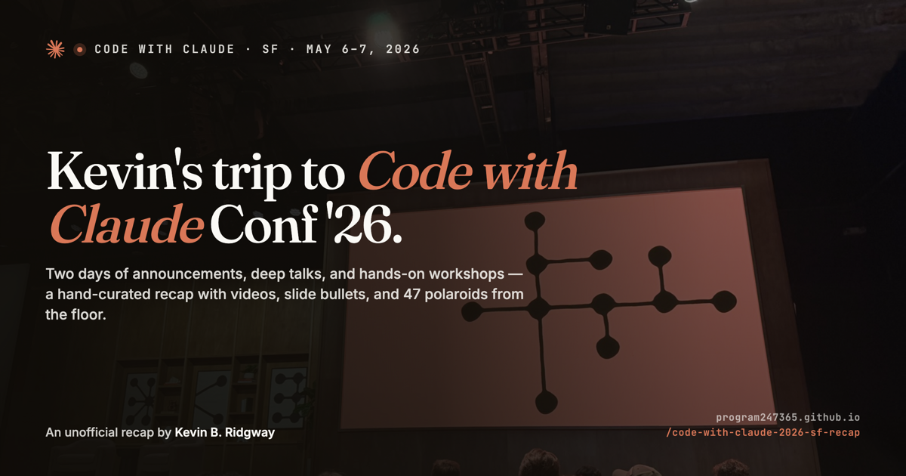

# Code with Claude · SF 2026 — Interactive Timeline

An unofficial fan recap of [**Code with Claude San Francisco**](https://claude.com/code-with-claude/san-francisco?ref=kbr.sh) (May 6, 2026) and [**Code with Claude Extended**](https://claude.com/code-with-claude/san-francisco-extended?ref=kbr.sh) (May 7, 2026) — the full schedule as a single interactive timeline, with embedded session videos, themes, and venue photos pulled from live notes.

**→ [program247365.github.io/code-with-claude-2026-sf-recap](https://program247365.github.io/code-with-claude-2026-sf-recap/)**



## What's in the site

- **39 sessions** across two days, organized as a single scrollable timeline with day breaks and per-talk metadata
- **Embedded YouTube videos** for every session that's been posted — the rest say "Not Yet Posted" until the daily cron picks them up
- **Themes view** — high-level patterns from the conference, each linked to the source talk that surfaced it (theme attributions are verified daily; broken ones surface as warnings rather than getting silently rewritten)
- **Around the room** — art-directed venue gallery from personal photos, HEIC → JPEG with EXIF scrubbed
- **Light + dark mode** with a deliberately gentle light masthead
- **Claude FM** — an optional ambient stream that plays as the masthead background; pill-toggleable
- **Open Graph + Twitter cards** for clean previews when shared

## How it's built

One HTML file. Inline CSS, inline JS, no build step. ~2,300 lines, all in [`index.html`](./index.html). Session data lives in a single `const SESSIONS = [...]` array near the bottom.

The trade-offs of this choice:

- **No framework, no transpile, no `node_modules`** — the file you edit is the file the browser runs. Diffs are honest. Behavior is one Cmd+F away.
- **No CMS** — adding a session is adding one object literal in source control. No content service, no API, no migration.
- **Trivially hostable** — any static file server works. GitHub Pages is just where it happens to live.

The cost is real: components can't be reused across pages, and one file does a lot. For a single-page recap that gets edited a few times a week, that's a great deal.

## Run it locally

```bash
python3 -m http.server 8000
```

Then open <http://localhost:8000>.

## How the timeline stays current

A GitHub Action runs daily at 15:00 UTC (08:00 PT). It:

1. Crawls the [@claude YouTube channel](https://www.youtube.com/@claude) and both official conference pages (clicking "View more" until every session is in the DOM).
2. Fuzzy-matches video titles to session titles using a normalized-token Jaccard score.
3. **Auto-applies high-confidence matches** (score ≥ 0.90) — flips `youtubeId: null` to `youtubeId: "<id>"` in the SESSIONS array.
4. Verifies every theme's `sessionUrl` still resolves to a session that exists.
5. Refreshes venue photos if new ones have been dropped into the source repo (HEIC → JPEG via `sips`, EXIF stripped via `exiftool`).
6. Commits and pushes back. Anything below the 0.90 threshold — medium-confidence matches, newly-discovered sessions, broken theme links — surfaces as a workflow warning for human review rather than getting auto-written.

The script never auto-writes prose, auto-adds sessions, or rewrites themes. Those are judgment calls.

## Adding or editing a session

Find `const SESSIONS` in [`index.html`](./index.html) and edit or add an entry:

```js
{
  day: 2,                          // 1 or 2
  time: "10:00",                   // ordering is by array position
  title: "…",
  speaker: "…",
  type: "talk",                    // keynote | announce | talk | workshop | officehours
  summary: "…",                    // short blurb on the timeline card
  tags: ["evals", "agents"],
  youtubeId: "dQw4w9WgXcQ",        // or null → shows "Not Yet Posted"
  takeaways: ["…", "…"],           // optional bullets in the modal
  sessionUrl: "https://…"          // optional link in the modal footer
}
```

The session count, the play-bubble overlay, the modal, and the themes view all derive from this array.

## Credits

Made by [Kevin B. Ridgway](https://kbr.sh) and [Claude](https://claude.ai?ref=kbr.sh).

Talk descriptions are paraphrased from the official session pages on [claude.com/code-with-claude](https://claude.com/code-with-claude/san-francisco?ref=kbr.sh). Videos embed from the official [@claude](https://www.youtube.com/@claude) uploads. Venue photos taken on-site. Not affiliated with Anthropic.
